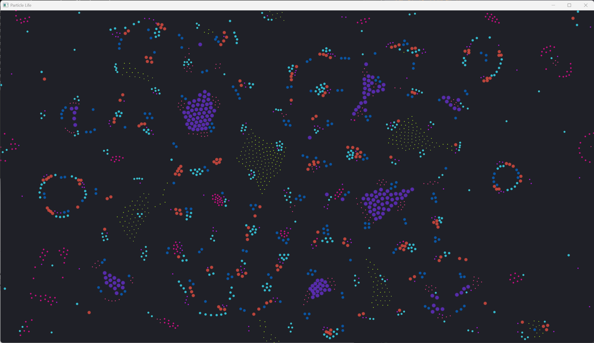

# ParticleLifeGL

A GPU-accelerated Particle Life simulation using OpenGL 4.3 compute shaders. Renders thousands of interacting particles with type-based attraction/repulsion forces, producing complex emergent behaviors reminiscent of living organisms.



## Requirements

- Windows / Linux (desktop)
- **OpenGL 4.3+** (required for compute shaders)
- **GLFW 3.x**
- **GLEW 2.x**
- CMake 3.10+

## Build

```bash
mkdir build && cd build
cmake ..
cmake --build . --config Release
```

Pre-built binaries require `glew32.dll` and `glfw3.dll` in the executable directory.

### Visual Studio (MSVC)

```bash
cmake -S . -B build -G "Visual Studio 16 2019" -A x64
cmake --build build --config Release
```

## Controls

| Key | Action |
|---|---|
| **R** | Reset — new random seed, same parameters |
| **F** | Randomize force matrix — particles change behavior |
| **C** | Randomize colors — generates well-separated colors |
| **X** | Full regenerate — random parameters, forces, colors, positions |
| **Mouse drag** | Pan the camera |
| **Scroll** | Zoom in / out |
| **ESC** | Exit |

## How it Works

Each particle has a **type** (0–9). A force matrix `F[a][b]` defines how type-`a` particles attract/repel type-`b` particles. On every frame:

1. **Compute shader** iterates all particle pairs (O(n²)) → calculates density → accumulates forces → integrates velocity & position
2. **Vertex shader** renders each particle as a colored circle, with size based on its type's total force involvement

Point sizes are statically assigned per type — types with higher force matrix involvement (stronger interactions) appear larger.

## Project Structure

```
src/
├── main.cpp            Entry point, window, input handling
├── simulation.h/cpp    Particle state, force matrix, color generation
├── renderer.h/cpp      GL state, SSBOs, shader management
└── shaders/
    ├── particle.vert   Vertex shader — point size + color
    ├── particle.frag   Fragment shader — soft circle
    └── physics.comp    Compute shader — O(n²) physics
```

## License

MIT
